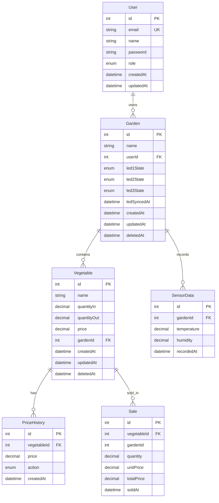

# Garden_SN

## 1. Tổng quan

`Garden_SN` là backend cho hệ thống IoT quản lý khu vườn, xây dựng bằng `NestJS + PostgreSQL + Prisma`.

Bài toán chính của dự án:
- Quản lý nhiều khu vườn theo từng người dùng
- Quản lý rau, tồn kho, giá hiện tại và lịch sử giá
- Tạo giao dịch bán hàng và tính doanh thu
- Nhận dữ liệu cảm biến từ thiết bị IoT qua MQTT
- Đẩy dữ liệu thời gian thực qua WebSocket
- Điều khiển LED cho từng khu vườn
- Xác thực JWT và phân quyền `ADMIN` / `USER`

## 2. Công nghệ sử dụng

- Backend: `NestJS`
- Database: `PostgreSQL`
- ORM: `Prisma 7`
- Authentication: `JWT`, `Passport`
- Validation: `class-validator`, `class-transformer`
- API docs: `Swagger`
- IoT: `MQTT`
- Realtime: `WebSocket / socket.io`

## 3. Cách chạy dự án

### 3.1. Cài dependency

```bash
npm install
```

### 3.2. Chạy app

```bash
npm run start:dev
```

### 3.3. Swagger

```text
http://localhost:3000/api
```

### 3.4. Prisma

```bash
npm run prisma:validate
npm run prisma:generate
npm run prisma:migrate:dev
npm run prisma:studio
```

## 4. Cấu trúc source

```text
garden_SN/
|-- src/
|   |-- common/
|   |-- config/
|   |-- modules/
|   |   |-- auth/
|   |   |-- users/
|   |   |-- gardens/
|   |   |-- vegetables/
|   |   |-- sales/
|   |   |-- reports/
|   |   |-- mqtt/
|   |   |-- sensors/
|   |   `-- websocket/
|   |-- prisma/
|   |-- app.module.ts
|   `-- main.ts
|-- prisma/
|   |-- migrations/
|   |-- manual-partial-index.sql
|   `-- schema.prisma
|-- prisma.config.ts
|-- .env
`-- .env.example
```

Ý nghĩa chính:
- `config/`: cấu hình app, jwt, mqtt
- `common/`: guard, decorator, enum, util, service dùng chung
- `prisma/`: `PrismaModule` và `PrismaService`
- `modules/`: toàn bộ module nghiệp vụ

## 5. Thiết kế dữ liệu

Schema hiện tại nằm ở:
- `prisma/schema.prisma`

### 5.1. ERD tổng quan



Ghi chú:
- `Sale.gardenId` được giữ để query và report nhanh
- Tính toàn vẹn của `Sale` được đảm bảo qua relation tới `Vegetable(id, gardenId)`
- `Garden` và `Vegetable` dùng `soft delete` qua `deletedAt`

### 5.2. Các bảng chính

`User`
- Lưu thông tin người dùng
- Một user có nhiều garden

`Garden`
- Thuộc về một user
- Có 3 trạng thái LED
- Dùng `soft delete`

`Vegetable`
- Thuộc về một garden
- Lưu số lượng nhập, số lượng đã bán, giá hiện tại
- Dùng `soft delete`

`PriceHistory`
- Lưu lịch sử thay đổi giá
- Phục vụ API xem danh sách giá theo thời gian

`Sale`
- Lưu lịch sử giao dịch bán
- `unitPrice` là giá snapshot tại thời điểm bán
- `totalPrice` được tính ở server-side

`SensorData`
- Lưu dữ liệu nhiệt độ, độ ẩm theo thời gian

### 5.3. Quan hệ dữ liệu

- `User 1 - N Garden`
- `Garden 1 - N Vegetable`
- `Garden 1 - N SensorData`
- `Vegetable 1 - N PriceHistory`
- `Vegetable 1 - N Sale`

Lưu ý với `Sale`:
- `Sale.gardenId` được giữ để query và report nhanh
- Tính toàn vẹn dữ liệu được đảm bảo bằng relation:
  - `Sale(vegetableId, gardenId) -> Vegetable(id, gardenId)`

### 5.4. Precision quan trọng

- `Vegetable.price`, `PriceHistory.price`, `Sale.unitPrice`: `Decimal(10,2)`
- `Sale.totalPrice`: `Decimal(14,2)`
- `Vegetable.quantityIn`, `Vegetable.quantityOut`, `Sale.quantity`: `Decimal(10,2)`
- `SensorData.temperature`, `SensorData.humidity`: `Decimal(5,2)`

### 5.5. Partial unique index

`Vegetable` dùng soft delete nên không dùng:

```prisma
@@unique([gardenId, name])
```

Thay vào đó dùng partial unique index để:
- Không cho trùng tên rau trong cùng garden khi record còn active
- Vẫn cho phép tạo lại rau cùng tên sau khi record cũ đã bị soft delete

SQL:

```sql
CREATE UNIQUE INDEX "vegetable_garden_name_active_unique"
ON "Vegetable" ("gardenId", "name")
WHERE "deletedAt" IS NULL;
```

## 6. Rule nghiệp vụ đã chốt

### 6.1. Quyền truy cập

- `ADMIN` được xem và quản lý toàn bộ garden
- `USER` chỉ được xem và quản lý garden của mình
- Các thao tác trên `Vegetable`, `Sale`, `SensorData`, `Reports`, `LED`, `WebSocket room` đều đi qua ownership của `Garden`

### 6.2. Soft delete

`Garden` và `Vegetable` dùng `deletedAt`

Quy ước hiện tại:
- Mọi query active đều phải lọc `deletedAt: null`
- Không thao tác trên `Garden` đã soft delete
- Không thao tác trên `Vegetable` đã soft delete
- Khi soft delete `Garden`, service sẽ soft delete luôn toàn bộ `Vegetable` active bên dưới trong cùng transaction

### 6.3. Tồn kho

- `quantityOut` không được sửa trực tiếp qua endpoint `vegetables`
- `quantityOut` chỉ được cập nhật trong `SalesService`
- Luôn đảm bảo:

```text
quantityOut <= quantityIn
```

### 6.4. Giá và lịch sử giá

- Giá hiện tại lưu ở `Vegetable.price`
- Mọi thao tác `set / update / delete` giá đều phải ghi thêm `PriceHistory`
- `GET /vegetables/:id/price` là lấy giá hiện tại
- `GET /price` là lấy danh sách lịch sử giá từ `PriceHistory`

### 6.5. Sale

- `POST /sales` không nhận `unitPrice`, `totalPrice` từ client
- `unitPrice` lấy từ `Vegetable.price` tại thời điểm bán
- `totalPrice = quantity * unitPrice`
- Tạo `Sale` và tăng `quantityOut` trong cùng transaction
- Nếu transaction fail thì DB không được đổi nửa chừng

### 6.6. Reports

`GET /price`
- Nguồn dữ liệu: `PriceHistory`
- Trả về danh sách record, không aggregate
- Hỗ trợ `period=day|week|month`
- Hiện tại lấy theo kỳ hiện tại tính từ thời điểm gọi API

`GET /all/price`
- Nguồn dữ liệu: `Sale`
- Dùng để tổng hợp doanh thu theo thời gian

### 6.7. MQTT, Sensor, WebSocket

Luồng sensor:
- Thiết bị publish vào topic MQTT
- `MqttService` subscribe và parse payload
- `SensorsService` lưu `SensorData` vào DB
- `WsGateway` phát realtime xuống room đúng `gardenId`

Luồng WebSocket:
- Client kết nối socket bằng JWT
- Sau khi connect thành công, client gửi `garden.join`
- Server check quyền truy cập garden rồi mới cho join room

Event socket hiện tại:
- `garden.joined`
- `garden.join.error`
- `sensor.updated`

### 6.8. LED

- DB lưu `desired state`
- Flow: API nhận request -> update DB -> publish MQTT -> nếu publish thành công thì update `ledSyncedAt`
- Nếu `ledSyncedAt < updatedAt` thì hiểu là còn lệnh chưa sync xuống thiết bị
- Chưa xử lý conflict giữa `desired state` và `actual state` trong phạm vi hiện tại

## 7. Trạng thái theo phase

### Phase 1 - Project setup & Database

Trạng thái: `DONE`

Đã làm:
- Khởi tạo project NestJS
- Cài dependency nền
- Setup `ConfigModule`, `.env`, `.env.example`
- Setup Prisma 7 + PostgreSQL
- Viết schema final
- Chạy migration
- Setup partial unique index bằng raw SQL
- Setup `PrismaModule`, `PrismaService`
- Setup Swagger
- Setup global `ValidationPipe`

### Phase 2 - Auth Module

Trạng thái: `DONE`

Đã có:
- `POST /auth/register`
- `POST /auth/login`
- `GET /users/me`
- `JwtAuthGuard`
- `RolesGuard`
- `@Roles()`
- `@CurrentUser()`
- `@Public()`

Logic chính:
- Register: hash password rồi mới lưu user
- Login: validate email/password bằng bcrypt, trả JWT access token
- `JwtStrategy` decode token rồi attach user vào request
- `JwtAuthGuard` và `RolesGuard` được apply global qua `APP_GUARD`

Open issue hiện tại:
- Login với email có khoảng trắng đầu/cuối có thể fail do `LocalAuthGuard` đọc raw body trước DTO transform

### Phase 3 - Garden & Vegetable Module

Trạng thái: `DONE`

Đã có:
- `POST /gardens`
- `GET /gardens`
- `GET /gardens/:id`
- `PUT /gardens/:id`
- `DELETE /gardens/:id`
- `POST /vegetables`
- `GET /vegetables?gardenId=...`
- `PUT /vegetables/:id`
- `DELETE /vegetables/:id`
- `POST /vegetables/:id/price`
- `PUT /vegetables/:id/price`
- `DELETE /vegetables/:id/price`
- `GET /vegetables/:id/price`

Logic chính:
- Garden delete là soft delete
- Vegetable delete là soft delete
- `GET /vegetables` bắt buộc có `gardenId`
- Mọi thao tác giá đều ghi `PriceHistory`
- Khi xóa mềm garden, service xóa mềm luôn vegetable con active

### Phase 4 - Sales & Reports Module

Trạng thái: `DONE`

Đã có:
- `POST /sales`
- `GET /price?gardenId=&period=day|week|month&vegetableId=optional`
- `GET /all/price?gardenId=&period=day|week|month`

#### SalesModule

Request body:

```json
{
  "gardenId": 1,
  "vegetableId": 10,
  "quantity": 2.5
}
```

Flow xử lý:
- Check ownership theo `body.gardenId`
- Check `Garden` còn active
- Check `Vegetable` còn active
- Check `Vegetable` thuộc đúng `gardenId`
- Check `Vegetable.price != null`
- Check tồn kho
- Tạo `Sale`
- Tăng `Vegetable.quantityOut`
- Trả response đã serialize Decimal sang number

Lưu ý:
- Project đang dùng `ValidationPipe({ whitelist: true, forbidNonWhitelisted: true })`
- Nếu client gửi thừa `unitPrice`, `totalPrice`, `quantityOut` thì sẽ bị `400`

#### ReportsModule

`GET /price`
- Dùng để xem danh sách `PriceHistory`
- Có `gardenId` bắt buộc
- Có `vegetableId` optional
- Trả về từng record gồm:
  - `id`
  - `vegetableId`
  - `vegetableName`
  - `action`
  - `price`
  - `createdAt`

`GET /all/price`
- Dùng để xem doanh thu từ `Sale`
- Aggregate theo `date_trunc(day|week|month, soldAt)`
- Trả:

```json
{
  "total": 45,
  "data": [
    {
      "periodStart": "2026-03-25T00:00:00.000Z",
      "salesCount": 2,
      "totalQuantity": 3.5,
      "totalRevenue": 45
    }
  ]
}
```

### Phase 5 - MQTT + Sensors + WebSocket

Trạng thái: `DONE`

Đã có:
- `MqttModule`
- `SensorsModule`
- `WebSocket Gateway`
- `POST /gardens/:id/led`
- `GET /sensors?gardenId=&period=day|week|month`

#### MQTT

Vai trò:
- Kết nối broker HiveMQ
- Subscribe sensor topic
- Parse payload JSON
- Delegate xuống `SensorsService`
- Publish lệnh LED

Sensor topic hiện tại:

```text
garden/+/sensor
```

LED control topic hiện tại:

```text
garden/{gardenId}/led/control
```

#### Sensors

`GET /sensors`
- `gardenId` bắt buộc
- `period=day|week|month`
- Dữ liệu trả về lấy từ `SensorData`

Luồng ingest:
- MQTT nhận message
- Parse payload
- Check garden còn active
- Lưu `SensorData`
- Emit realtime qua socket room tương ứng

#### WebSocket

Handshake:
- Verify JWT khi client connect
- Nếu token lỗi thì bị từ chối ngay ở bước handshake
- Client sẽ nhận lỗi kết nối theo cơ chế `connect_error` của Socket.IO, không đi vào phiên socket thành công

Join room:
- Client gửi event `garden.join`
- Server check quyền garden
- Nếu pass thì emit `garden.joined`
- Nếu fail thì emit `garden.join.error`

Lưu ý:
- Đã đổi event lỗi từ `error` sang event custom để tránh Postman hiểu nhầm là lỗi runtime rồi tự disconnect

#### LED control

Endpoint:
- `POST /gardens/:id/led`

Body:
- `led1State?`
- `led2State?`
- `led3State?`

Rule:
- 3 field đều optional
- Nhưng request phải có ít nhất 1 field
- Update desired state trong DB trước
- Publish MQTT sau
- Publish thành công mới update `ledSyncedAt`

## 8. API hiện có

### Auth

- `POST /auth/register`
- `POST /auth/login`
- `GET /users/me`

### Gardens

- `POST /gardens`
- `GET /gardens`
- `GET /gardens/:id`
- `PUT /gardens/:id`
- `DELETE /gardens/:id`
- `POST /gardens/:id/led`

### Vegetables

- `POST /vegetables`
- `GET /vegetables?gardenId=...`
- `PUT /vegetables/:id`
- `DELETE /vegetables/:id`
- `POST /vegetables/:id/price`
- `PUT /vegetables/:id/price`
- `DELETE /vegetables/:id/price`
- `GET /vegetables/:id/price`

### Sales & Reports

- `POST /sales`
- `GET /price?gardenId=&period=day|week|month&vegetableId=optional`
- `GET /all/price?gardenId=&period=day|week|month`

### Sensors

- `GET /sensors?gardenId=&period=day|week|month`
