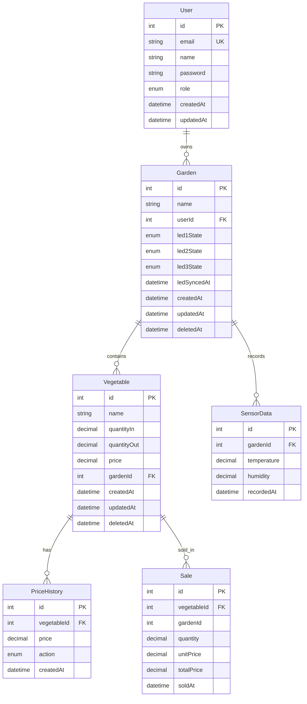

# Garden_SN

## 1. Tổng quan

`Garden_SN` là backend cho hệ thống IoT quản lý khu vườn, xây dựng bằng `NestJS + PostgreSQL + Prisma`.

Dự án hiện đã hoàn thành các nhóm chức năng chính:
- Quản lý nhiều khu vườn theo từng người dùng
- Quản lý rau, tồn kho, giá hiện tại và lịch sử giá
- Tạo giao dịch bán hàng và tính doanh thu
- Nhận dữ liệu cảm biến từ thiết bị IoT qua MQTT
- Đẩy dữ liệu thời gian thực qua WebSocket
- Điều khiển LED cho từng khu vườn
- Xác thực JWT và phân quyền `ADMIN` / `USER`

Chi tiết tiến độ triển khai, phạm vi từng phase và cách test tay theo từng phase xem tại:
- `ROADMAP.md`

## 2. Công nghệ sử dụng

- Backend: `NestJS`
- Database: `PostgreSQL`
- ORM: `Prisma 7`
- Authentication: `JWT`, `Passport`
- Validation: `class-validator`, `class-transformer`
- API docs: `Swagger`
- IoT: `MQTT`
- Realtime: `WebSocket / Socket.IO`

## 3. Cách chạy dự án

### 3.1. Cài dependency

```bash
npm install
```

### 3.2. Chạy app

```bash
npm run start:dev
```

### 3.3. Swagger

```text
http://localhost:3000/api
```

### 3.4. Prisma

```bash
npm run prisma:validate
npm run prisma:generate
npm run prisma:migrate:dev
npm run prisma:studio
```

### 3.5. Bảng biến môi trường (`.env`)

| Biến | Mô tả |
|---|---|
| `PORT` | Port chạy ứng dụng NestJS |
| `DATABASE_URL` | Chuỗi kết nối PostgreSQL cho Prisma |
| `JWT_SECRET` | Secret dùng để ký và verify JWT |
| `JWT_EXPIRES_IN` | Thời gian hết hạn JWT, ví dụ `1d`, `7d` |
| `MQTT_BROKER_URL` | URL broker MQTT / HiveMQ |
| `MQTT_USERNAME` | Username đăng nhập broker MQTT |
| `MQTT_PASSWORD` | Password đăng nhập broker MQTT |
| `MQTT_CLIENT_ID` | Client ID dùng khi app kết nối broker |

Ghi chú:
- File mẫu nằm ở `.env.example`
- `JWT_SECRET` và các biến MQTT là các biến quan trọng nhất cần cấu hình đúng trước khi test

## 4. Cấu trúc source

```text
garden_SN/
|-- src/
|   |-- common/
|   |-- config/
|   |-- modules/
|   |   |-- auth/
|   |   |-- users/
|   |   |-- gardens/
|   |   |-- vegetables/
|   |   |-- sales/
|   |   |-- reports/
|   |   |-- mqtt/
|   |   |-- sensors/
|   |   `-- websocket/
|   |-- prisma/
|   |-- app.module.ts
|   `-- main.ts
|-- prisma/
|   |-- migrations/
|   |-- manual-partial-index.sql
|   `-- schema.prisma
|-- prisma.config.ts
|-- .env
`-- .env.example
```

Ý nghĩa chính:
- `config/`: cấu hình app, jwt, mqtt
- `common/`: guard, decorator, enum, util, service dùng chung
- `prisma/`: `PrismaModule` và `PrismaService`
- `modules/`: toàn bộ module nghiệp vụ

## 5. Thiết kế dữ liệu

Schema hiện tại nằm ở:
- `prisma/schema.prisma`

### 5.1. ERD tổng quan



Ghi chú:
- `Sale.gardenId` được giữ để query và report nhanh
- Tính toàn vẹn của `Sale` được đảm bảo qua relation tới `Vegetable(id, gardenId)`
- `Garden` và `Vegetable` dùng `soft delete`

### 5.2. Các bảng chính

`User`
- Lưu thông tin người dùng
- Một user có nhiều garden

`Garden`
- Thuộc về một user
- Có 3 trạng thái LED
- Dùng `soft delete`

`Vegetable`
- Thuộc về một garden
- Lưu số lượng nhập, số lượng đã bán, giá hiện tại
- Dùng `soft delete`

`PriceHistory`
- Lưu lịch sử thay đổi giá
- Phục vụ API xem danh sách giá theo thời gian

`Sale`
- Lưu lịch sử giao dịch bán
- `unitPrice` là giá snapshot tại thời điểm bán
- `totalPrice` được tính ở server-side

`SensorData`
- Lưu dữ liệu nhiệt độ, độ ẩm theo thời gian

### 5.3. Quan hệ dữ liệu

- `User 1 - N Garden`
- `Garden 1 - N Vegetable`
- `Garden 1 - N SensorData`
- `Vegetable 1 - N PriceHistory`
- `Vegetable 1 - N Sale`

Lưu ý với `Sale`:
- `Sale.gardenId` được giữ để query và report nhanh
- Tính toàn vẹn dữ liệu được đảm bảo bằng relation:
  - `Sale(vegetableId, gardenId) -> Vegetable(id, gardenId)`

### 5.4. Precision quan trọng

- `Vegetable.price`, `PriceHistory.price`, `Sale.unitPrice`: `Decimal(10,2)`
- `Sale.totalPrice`: `Decimal(14,2)`
- `Vegetable.quantityIn`, `Vegetable.quantityOut`, `Sale.quantity`: `Decimal(10,2)`
- `SensorData.temperature`, `SensorData.humidity`: `Decimal(5,2)`

### 5.5. Partial unique index

`Vegetable` dùng soft delete nên không dùng:

```prisma
@@unique([gardenId, name])
```

Thay vào đó dùng partial unique index để:
- Không cho trùng tên rau trong cùng garden khi record còn active
- Vẫn cho phép tạo lại rau cùng tên sau khi record cũ đã bị soft delete

SQL:

```sql
CREATE UNIQUE INDEX "vegetable_garden_name_active_unique"
ON "Vegetable" ("gardenId", "name")
WHERE "deletedAt" IS NULL;
```

## 6. Rule nghiệp vụ đã chốt

### 6.1. Quyền truy cập

- `ADMIN` được xem và quản lý toàn bộ garden
- `USER` chỉ được xem và quản lý garden của mình
- Các thao tác trên `Vegetable`, `Sale`, `SensorData`, `Reports`, `LED`, `WebSocket room` đều đi qua ownership của `Garden`

### 6.2. Nguồn chân lý dữ liệu

- Giá hiện tại: `Vegetable.price`
- Lịch sử giá: `PriceHistory`
- Số lượng đã bán: `Vegetable.quantityOut`
- Doanh thu: `Sale`
- Quyền truy cập dữ liệu: `Garden.userId`

### 6.3. Soft delete

`Garden` và `Vegetable` dùng `deletedAt`

Quy ước hiện tại:
- Mọi query active đều phải lọc `deletedAt: null`
- Không thao tác trên `Garden` đã soft delete
- Không thao tác trên `Vegetable` đã soft delete
- Khi soft delete `Garden`, service sẽ soft delete luôn toàn bộ `Vegetable` active bên dưới trong cùng transaction

### 6.4. Tồn kho

- `quantityOut` không được sửa trực tiếp qua endpoint `vegetables`
- `quantityOut` chỉ được cập nhật trong `SalesService`
- Luôn đảm bảo:

```text
quantityOut <= quantityIn
```

### 6.5. Giá và lịch sử giá

- Giá hiện tại lưu ở `Vegetable.price`
- Mọi thao tác `set / update / delete` giá đều phải ghi thêm `PriceHistory`
- `GET /vegetables/:id/price` là lấy giá hiện tại
- `GET /price` là lấy danh sách lịch sử giá từ `PriceHistory`

### 6.6. Sale

- `POST /sales` không nhận `unitPrice`, `totalPrice` từ client
- `unitPrice` lấy từ `Vegetable.price` tại thời điểm bán
- `totalPrice = quantity * unitPrice`
- Tạo `Sale` và tăng `quantityOut` trong cùng transaction
- Nếu transaction fail thì DB không được đổi nửa chừng

### 6.7. Reports

`GET /price`
- Nguồn dữ liệu: `PriceHistory`
- Trả về danh sách record, không aggregate
- Hỗ trợ `period=day|week|month`
- Hiện tại lấy theo kỳ hiện tại tính từ thời điểm gọi API

`GET /all/price`
- Nguồn dữ liệu: `Sale`
- Dùng để tổng hợp doanh thu theo thời gian

### 6.8. MQTT, Sensor, WebSocket

Luồng sensor:
- Thiết bị publish vào topic MQTT
- `MqttService` subscribe và parse payload
- `SensorsService` lưu `SensorData` vào DB
- `WsGateway` phát realtime xuống room đúng `gardenId`

Luồng WebSocket:
- Client kết nối socket bằng JWT
- Sau khi connect thành công, client gửi `garden.join`
- Server check quyền truy cập garden rồi mới cho join room

### 6.9. LED

- DB lưu `desired state`
- Flow: API nhận request -> update DB -> publish MQTT -> nếu publish thành công thì update `ledSyncedAt`
- Nếu `ledSyncedAt < updatedAt` thì hiểu là còn lệnh chưa sync xuống thiết bị

### 6.10. MQTT Topics & WebSocket Events

#### MQTT Topics

| Loại | Topic | Mô tả |
|---|---|---|
| Subscribe | `garden/+/sensor` | App lắng nghe dữ liệu cảm biến từ thiết bị |
| Publish | `garden/{gardenId}/led/control` | App gửi lệnh điều khiển LED tới thiết bị |

#### WebSocket Events

| Event | Hướng | Mô tả |
|---|---|---|
| `connect_error` | Server -> Client | Token lỗi ở handshake, socket bị từ chối ngay lúc kết nối |
| `garden.join` | Client -> Server | Client yêu cầu join room theo `gardenId` |
| `garden.joined` | Server -> Client | Join room thành công |
| `garden.join.error` | Server -> Client | Join room thất bại do sai quyền hoặc garden không hợp lệ |
| `sensor.updated` | Server -> Client | Có dữ liệu cảm biến mới cho room hiện tại |

## 7. Trạng thái hiện tại

Dự án hiện đã hoàn thành đến hết `Phase 5`:
- Setup project, database, Swagger
- Auth + role-based authorization
- CRUD Garden + Vegetable + Price
- Sales + Reports
- MQTT + Sensors + WebSocket
- LED control qua MQTT

Ghi chú:
- Phần roadmap / tiến trình phát triển chi tiết nên tách riêng khỏi README nếu cần theo dõi sâu hơn
- README này ưu tiên mô tả dự án đang làm được gì và cách sử dụng

## 8. API hiện có

### 8.1. Auth

- `POST /auth/register`
- `POST /auth/login`
- `GET /users/me`

### 8.2. Gardens

- `POST /gardens`
- `GET /gardens`
- `GET /gardens/:id`
- `PUT /gardens/:id`
- `DELETE /gardens/:id`
- `POST /gardens/:id/led`

### 8.3. Vegetables & Price

- `POST /vegetables`
- `GET /vegetables?gardenId=...`
- `PUT /vegetables/:id`
- `DELETE /vegetables/:id`
- `POST /vegetables/:id/price`
- `PUT /vegetables/:id/price`
- `DELETE /vegetables/:id/price`
- `GET /vegetables/:id/price`

### 8.4. Sales & Reports

- `POST /sales`
- `GET /price?gardenId=&period=day|week|month&vegetableId=optional`
- `GET /all/price?gardenId=&period=day|week|month`

### 8.5. Sensors

- `GET /sensors?gardenId=&period=day|week|month`

### 8.6. WebSocket

Socket.IO workflow:
- Kết nối socket với JWT
- Gửi event `garden.join`
- Nhận `garden.joined` hoặc `garden.join.error`
- Khi có dữ liệu mới sẽ nhận `sensor.updated`

## 9. Ghi chú kiểm thử

- Swagger: `http://localhost:3000/api`
- MQTT broker phải cấu hình đúng trong `.env`
- WebSocket auth hiện dùng handshake middleware
- Nếu token sai, client sẽ nhận lỗi theo cơ chế `connect_error` của Socket.IO
